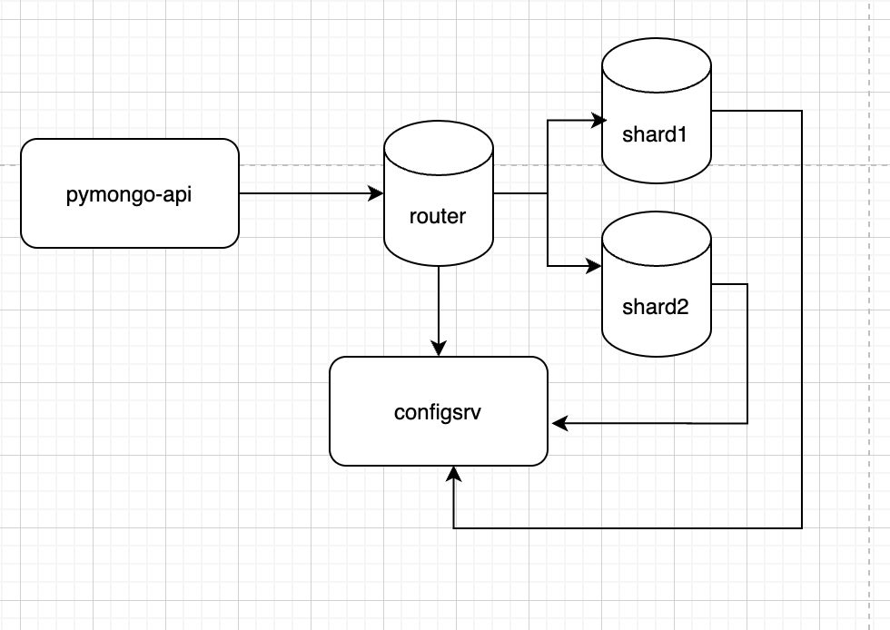

Для запуска проекта необходимо выполнить

```bash
docker-compose up -d
```

Если экземпляры mongodb не настраивались:
1) Подключиться к серверу конфигурации 
```bash
docker exec -it configSrv mongosh --port 27017
```
И выполнить инициализацию репликационного сета для конфигурационного сервера в MongoDB

```bash
rs.initiate(
  {
    _id : "config_server",
       configsvr: true,
    members: [
      { _id : 0, host : "configSrv:27017" }
    ]
  }
);
```

2) Инициализировать шарды

Подключиться к первому шарду
```bash
docker exec -it shard1 mongosh --port 27018
```

Этот код инициализирует репликационный сет с именем shard1, состоящий из одного узла с адресом shard1:27018, который будет использоваться как шард в шардированной системе MongoDB.

```bash
rs.initiate(
    {
      _id : "shard1",
      members: [
        { _id : 0, host : "shard1:27018" }
      ]
    }
);
```

Подключиться ко второму шарду
```bash
docker exec -it shard2 mongosh --port 27019
```

инициализировать репликационный сет для shard2

```bash
rs.initiate(
    {
      _id : "shard2",
      members: [
       { _id : 1, host : "shard2:27019" }
      ]
    }
  );
```

3) Проинициализировать роутер

Подключиться к роутеру
```bash
docker exec -it mongos_router mongosh --port 27020
```
Добавить в роутер шарды

```bash
sh.addShard( "shard1/shard1:27018");
sh.addShard( "shard2/shard2:27019");

sh.enableSharding("somedb");
sh.shardCollection("somedb.users", { "name" : "hashed" } )
```